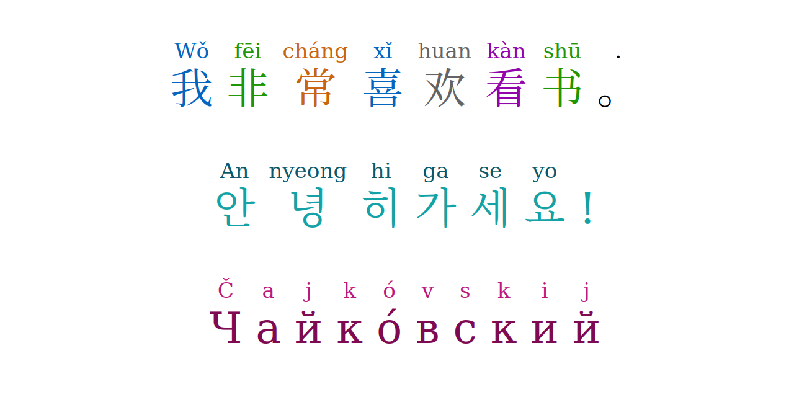

# hermes-react

_Elegant i18n for React in TypeScript_


[](https://badge.fury.io/js/@giancosta86%2Fhermes-react)
[](/LICENSE)



**hermes-react** is a **TypeScript** library for **React** dedicated to **i18n** - especially _elegant decorated typography_, for example _romanization_ of non-latin writing systems - inspired by my general-purpose [hermes](https://github.com/giancosta86/hermes) library.

## Installation

### TypeScript

The package on NPM is:

> @giancosta86/hermes-react

The public API entirely resides in the root package index, so you shouldn't reference specific modules.

### CSS stylesheet

The library comes with a ready-made **CSS stylesheet** - providing typographic enhancements such as **pinyin tone colors** - which you can _optionally_ reference in your projects.

In particular, if you are using [Next.js](https://nextjs.org/), you just need to add one line to the import block of your `_app.tsx` file:

```typescript
import "@giancosta86/hermes-react/dist/index.css";
```

Once referenced the CSS stylesheet, if you start decorating characters with the provided metadata - such as the ones in the `Pinyin` namespace - you'll see them rendered in color by the `<DecoratedText/>` component.

## Usage

### DecoratedText

`<DecoratedText/>` is a component with the following properties:

- `text` - the text to be formatted

- `metadataByChar` - mapping each _decorated character_ to its typographic _metadata_

where `metadataByChar` is any `RMap` (provided by the Rimbu library) whose entries have:

- for _key_, a single character that should be decorated

- for _value_, the related `CharMetadata` object containing at least one of:

  - the `annotation string` - to be printed on top of the character

  - optionally, a `class name` string used to style the whole character box

The component formats the given `text` according to the following algorithm:

1. The text is trimmed

1. Any `\r\n` is converted to `\n`

1. Every additional `\n` at the end of a `\n\n` sequence is ignored

1. The text is split into paragraphs - `<p>` blocks - separated by `\n\n` sequences that are used as separators and then ignored

1. Within every paragraph:

   1. `\n` is mapped to `<br/>`

   1. for every other character:

      - if the character has metadata in the `metadataByChar` map:

        - the related annotation string is printed on top of the character

        - the whole structure is packed into a `<ruby>` tag, styled with the (optional) requested classes

      - otherwise, the character is printed verbatim, with no additional HTML tags

### Pinyin - Simplified Chinese

When annotating a _pinyin_ logogram, you can associate to its `className` metadata one of the following values (actually, strings) of the `Pinyin` namespace:

- `flat`

- `rising`

- `fallingRising`

- `falling`

- `neuter`

If you need more granular control, you can reference the constants declared in the `PinyinTone` namespace - having the same names but providing just the tone class name.

If you import the **stylesheet** provided by the library, the component will render the characters in color.

### Glyph character classes

The `Glyph` namespace provides general-purpose class names - such as `latin`, `nonLatin`, `phonogram`, `logogram`, ..., which you can use to style your decorated characters.

## See also

- [hermes](https://github.com/giancosta86/hermes) - Minimalist i18n in TypeScript

- [rimbu](https://rimbu.org/) - Immutable collections and tools for TypeScript

- [Next.js](https://nextjs.org/) - The React Framework for the Web
